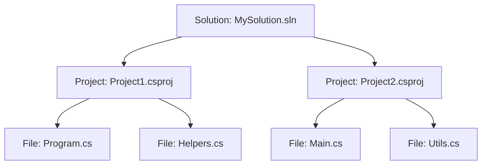
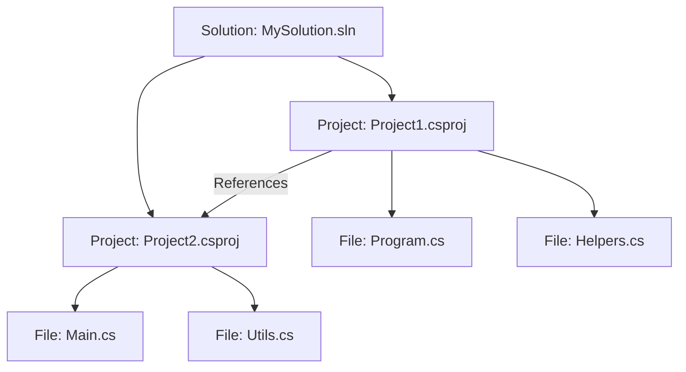
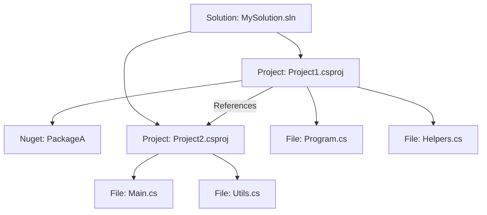

### CIS-230-SP25

## Assignment 01

Colorado Christian University Computer Information Systems

### Resources

You can download and install .NET from [https://get.dot.net](https://get.dot.net).

- We are using .NET version 9.
- We are using C# version 12.
- We are using the VS Code IDE.
- VS Code requires `C# Dev Kit` extension

## State Capital Viewer

The State Capital Viewer is a console application that accesses a public internet API returning a JSON formatted list of `CityName + StateCode` ([Capitals](https://cis-230-sp25.azurewebsites.net/api/Capitals)) and `StateName + StateCode` ([States](https://cis-230-sp25.azurewebsites.net/api/States)). The `StateCode` is the same in both cases and can be used to join the two datasets to produce the complete value `CityName + StateName`.

## Solution Primer

C# is written in `.cs` files, which are grouped together in projects (defined in the `.csproj` file & created using the command `dotnet new {project-type-name}`). Projects are grouped together in a solution (defined in the `.sln` file & created using the command `dotnet new sln`). A solution can have one or more projects, and a project can have one or more code files.



**Project References**

Code in Project1, for example, can be isolated to only Project1. However, Project1 could create a project reference to Project2. This integrates the code in Project2 into Project1. Though Project2 can still operate completely independent of Project1, once Project1 creates a reference dependency on Project2, this constraint means it can no longer operate without Project2. This is not inheritance, in the OOP sense, just project referencing in .NET solutions. There are security mechanisms available to prevent unwanted referencing of your projects, but project references are a building block to simplified & modular code bases.



**Nuget References**

In addition to other projects, you can create a *reference dependency* on projects stored as packages on accessible code registries (or package managers) like [NuGet.org](https://NuGet.org) - a free service provided by Microsoft with thousands of packages and millions of downloads. Most packages are free (or open source) though a few require a license. You can put your own packages in NuGet with the caveat that anyone could download them, for this reason a company can opt to host a local, secured version of NuGet for themselves.



**All the things**

It might be interesting to note that .NET itself is a modular family of packages stored in NuGet. Most namespaces (like `System.Net` and `System.Text`) are packaged individually and downloaded to your machine when you restore project dependencies—at least they are downloaded the first time; after that, they are cached locally for faster access. 

A process called *tree shaking* may be used to review your code, after your development work is over, to delete references to packages not used in your code and subsequently reduce its size.

## Command Line

Using `dotnet build`, you can compile code into either a `.dll` file (Dynamic Link Library) or an `.exe` file (Executable) depending on the type of project. While `dotnet build` compiles all the code in all the projects in a solution, `dotnet build myproject.csproj` compiles all the code in a single project.

## Getting Started

```sh
dotnet new console -o MyAppFolder -n MyAppName
```

| Option | Function
|- |-
|`-o` |Output folder
|`-n` |Project name

The command above creates a brand new project using `-o` to indicate the folder it will be created in (it will create this folder if it does not exist) and `-n` to indicate the name of the project and the default namespace.

After running, you would find the file `/MyAppFolder/MyAppName.csproj` and a default `Program.cs` file which serves as the program's entry point.

It's worth noting that both `-o` and `-n` are optional, when `-o` is omitted, the project will be created in the current directory, not a subfolder. When `-n` is omitted, the name will be inherited from the folder name.

**Other types of projects**

| Command | Name
|-|-
| `dotnet new console` | Console Application
| `dotnet new webapi` | Web API
| `dotnet new classlib` | Class Library
| `dotnet new blazor` | Blazor App
| `dotnet new xunit` | Unit Test Project

You can list all available templates using `dotnet new --list`.

**Other types of creatable items**

| Command | Name
|-|-
| `dotnet new sln` | A Solution File (the SLN)
| `dotnet new gitignore` | A gitignore File
| `dotnet new editorconfig` | A editorconfig File

### Creating Structure

```sh
dotnet new sln
dotnet sln add /MyAppFolder/MyAppName.csproj
```

The first command above creates a solution file and the second adds the project to that solution. The `dotnet sln add` command can be again to add any other projects. This allows you to open or operate against multiple projects in single commands.

### Making it run

The `dotnet` command line is all you need to get your code compiled and running. When your code is written, use `dotnet build` to compile it and `dotnet run` to execute it. If it's a console application, it runs in the terminal. If it's a web app, a browser can be configured to launch automatically. 

Other commands include `dotnet restore`, which downloads NuGet packages; `dotnet clean`, which deletes files created by previous `dotnet build` operations; and `dotnet test`, which executes unit tests in your solution if any exist.

If you use Visual Studio or VS Code, these IDEs run most `dotnet` operations behind the scenes. Understanding these foundational operations is crucial for debugging when issues arise, as it simplifies troubleshooting. Some developers, though, prefer the command line every time. This is just personal preference; there's little technical benefit either way.

**Typical starter code**

```csharp
Console.WriteLine("Hello, World!");
```

Several years ago, the .NET team introduced the ability to write *top-level* statements, simple one-liners that just run. They allow developers, especially students, to start coding quickly and easily. The typical ceremony required to get code working is optional until more complex code is introduced, which may never be necessary.

Here's how that one line looks to the compiler.

```csharp
using System;

class Program
{
    static void Main(string[] args)
    {
        Console.WriteLine("Hello, World!");
    }
}
```

Now, this is not complex, but it does require quite a bit of upfront understanding before you can just start coding. For us, though, it6 is important we talk through each component to understand them when you inevitable come across them in other parts of your projects. 

### Line by line

```csharp
using System;
```

This line is a **using directive**, which allows you to use the `System` namespace. A namespace organizes related classes, and `System` includes essential classes like `Console`. Without this line, you'd need to write `System.Console.WriteLine` instead of just `Console.WriteLine`.

```csharp
class Program
{
}
```

This defines a **class** named `Program`. A class is a container for your code and is a fundamental building block in C#. Every application must have at least one class.

```csharp
static void Main(string[] args)
{
}
```

The **Main method** is the entry point of a C# program. When you run your program, this method is executed first.
This ane every other method signature is very important. They define how a method is used and what to expect from it.

A good method signature helps you, and anyone else reading the code, understand what’s happening, making it easier to debug, maintain, and collaborate on. A bad method signature, well, it's just the worst.

```csharp
Console.WriteLine("Hello, World!");
```

This line calls the `WriteLine` method of the `Console` class, which prints the text `"Hello, World!"` to the console. This is how you output information to the screen/user.

## Assignment details

Software acceptance criteria are like an academic rubric. They define what is required and outline the details for each requirement. In software, this is called "the definition of done," giving you confidence that you’ve met expectations.

There are two types of acceptance criteria. The first are the universal ones. These are criteria that are expected to be met without being mentioned. They include things like code hygiene: well-written, linted, documented, and tested. The level of each of these is negotiable, but the lack of them is generally unacceptable.

The second type of acceptance criteria are **specific criteria** unique to the project or task. These explicitly define requirements like functionality, performance, or compliance, tailored to the project's or, in this case, the assignment's goals. While these criteria might evolve into broader tasks, the criteria for a single task should remain static—moving targets can be incredibly frustrating.

### Universal Criteria (every assignment)

 - [ ] All work is in your GitHub assignment repository with `git push`
 - [ ] All work can build successfully with `dotnet build`
 - [ ] All work can run successfully with `dotnet run`

### Assignment Criteria (this assignment)

 - [ ] Download both Capitals from the internet API
 - [ ] Download both States from the internet API
 - [ ] Join Capitals & States with StateCode
 - [ ] Prompt the user to filter the report
 - [ ] Prompt the user to sort the report
 - [ ] Present a text-based, tabular "City, State" report
 
### Instructions